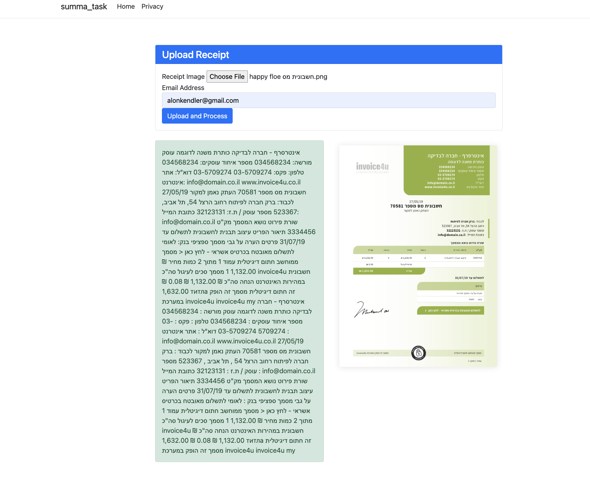

https://learn.microsoft.com/en-us/aspnet/core/?view=aspnetcore-8.0

project initialized by `dotnet new webapp`

# Summa Task

## Overview

Summa Task is a web application designed to process Hebrew tax receipts and text images, using OCR and extract the text. The application allows users to upload an image of a receipt, processes the image using Google Vision API, and displays the text on the web page. The text is also sent to the provided email address.

## Features

- Upload receipt images
- Extract text from images using OCR (Google Vision API)
- Display text and image on the web page
- Send text via email

## Technologies Used

- ASP.NET Core Razor Pages
- jQuery and AJAX for client-side scripting
- Google Vision API for OCR
- Resend API for sending emails

## Getting Started

### Prerequisites

- .NET 6 SDK
- Google Cloud account with Vision API enabled
- Resend API key

### Installation

1. Clone the repository:

   ```bash
   git clone https://github.com/yourusername/summa-task.git
   cd summa-task
   ```

2. Add your API keys and other necessary configuration settings in `appsettings.json` or as environment variables.

   ```json
   {
     "GoogleCredentials": "service-account.json",
     "Resend": {
       "ApiToken": "your_resend_api_token"
     },
     "EmailSender": "your_email@example.com"
   }
   ```

3. Place your `service-account.json` file in the root folder of the project.

4. Restore dependencies and run the application:

   ```bash
   dotnet restore
   dotnet run
   ```

5. Open your browser and navigate to `https://localhost:5238`.

## Usage

1. Upload a receipt image using the provided form.
2. Enter your email address.
3. Submit the form to process the image.
4. View the text on the web page and check your email for the JSON.

## Project Structure

- **Pages**: Contains Razor Pages for the web application.

  - `Index.cshtml`: Main page for uploading and processing receipt images.

- **Services**: Contains service classes for handling image processing and email sending.
  - `GoogleVisionImageProcessingService.cs`: Service for processing images using Google Vision API.
  - `ResendEmailService.cs`: Service for sending emails using Resend API.
- **wwwroot**: Contains static files such as CSS, JS, and images.
- **Program.cs**: Entry point for the application, configuring services and middleware.

## Contributing

1. Fork the repository.
2. Create a new branch: `git checkout -b feature/your-feature-name`.
3. Make your changes and commit them: `git commit -m 'Add some feature'`.
4. Push to the branch: `git push origin feature/your-feature-name`.
5. Submit a pull request.

## License

This project is licensed under the MIT License. See the [LICENSE](LICENSE) file for details.

## Acknowledgements

- [Google Cloud Vision API](https://cloud.google.com/vision)
- [Resend](https://resend.com/)

## Contact

For any questions or feedback, please contact [Alonkendler@gmail.com](mailto:Alonkendler@gmail.com).

## Screenshot


